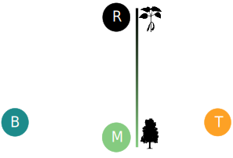

# talkTemplate

[](https://travis-ci.org/willvieira/talkTemplate)


## Setup

It is recomended to install all (R packages 📦) dependencies:

```make
make install
```

If you use other R packages for your presentation, add them to the `requeriments.yml` file

Once dependencies are solved, you can server your presentation on local to be automatically updated while editing:

```make
make server
```

Finally, publish your final `html` presentation with:

```make
make
```

## Slide content

### Sections

Slides are separeted by `---`:


```markdown
---
# My slide title

Content here

---
```

Title sections, like the previous slide, needs to specify the following classes:

```markdown
---
class: middle, center, inverse

# Title of my section
<hr width="100%" align="left" size="0.3" color="orange"></hr>

---
```

You can use one of these classes in any slide if you want to:
- Vertical center the content (`middle`)
- Horizontal center the content (`center`)
- Or inverse the background and text colours (`inverse`)


### Tables

You can simply insert a markdown table:


| Tables   |      Are      |  Cool |
|----------|:-------------:|------:|
| col 1 is |  left-aligned | $1600 |
| col 2 is |    centered   |   $12 |
| col 3 is | right-aligned |    $1 |


Or you can use the `DT` R package for dynamic tables:


```r
DT::datatable(head(cars))
```

### Figures

Insert an image:


```markdown

```


Scale the size of an image:

```md

```

Or simply code it.

<!--
Or simply code it:

```md
```r
plot(cars$speed, cars$dist)
```
```

Use the code chunck options to change the size of a plot :

```md

```r
#plot(cars$speed, cars$dist)
```
```
-->

*You can check a full list of chunck options [here](https://yihui.org/knitr/options/)*


### Columns

50/50 columns can be created with:


```markdown
.pull-left[
  Content 1
]
.pull-right[
  content 2
]
```

For left larger columns:

```markdown
.pull-left1[
  Content 1
]
.pull-right1[
  content 2
]
```

Or right larger columns:


```markdown
.pull-left2[
  Content 1
]
.pull-right2[
  content 2
]
```

### Text position

Instead of using columns, you can define the content position with:


Left aligned

```markdown
.left[text here]
```

Center aligned

```markdown
.left[text here]
```

Right aligned

```markdown
.left[text here]
```

### Text size

And also text size:


```markdown
.fontX[
  Content here
]
```

Where `X` can be anything between `10` (.font10[very small]) and `200` (.font200[HUGE]) by an increent of `10`:


### Math

$\LaTeX$ math expressions can be writen between `$$`:


```markdown
$$
  \bar{X}=\frac{1}{n}\sum_{i=1}^nX_i
$$
```


### Citation

This macro is just to easily insert text on the bottom of the slide:


```markdown
.cite[Talluto et al. [2017](https://link) Nat. Ecol. Evol.]
```
