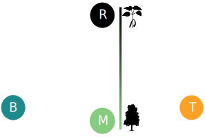

```{r setup, echo = F}
knitr::opts_chunk$set(
  comment = "#",
  #cache = TRUE,
  collapse = TRUE,
  warning = FALSE,
  message = FALSE,
  fig.width = 7,
  fig.height = 5.25,
  fig.align = 'center',
  fig.retina = 3
)

# base plot layout
mypar = list(mar = c(3,3,0.5,0.5), mgp = c(1.5, 0.3, 0), tck = -.008)

# xaringan Extra
xaringanExtra::use_xaringan_extra(c("tile_view", "animate_css", "tachyons"))
xaringanExtra::use_extra_styles(
  hover_code_line = TRUE,         #<<
  mute_unhighlighted_code = TRUE  #<<
)
xaringanExtra::use_editable(expires = 1)
xaringanExtra::use_panelset()
```
class: middle, title-slide

<!-- top logo (comment to remove or edit on `conf/css/style.css:23`) -->
<div class="lab-logo"></div>
<!-- <div class="uni-logo"></div> -->

# Title of my talk template

<hr width="65%" align="left" size="0.3" color="orange"></hr>

## My talk subtitle

### Willian Vieira, .small[PhD candidate <br> + Collaborators]

<br><br><br><br><br>
[<i class="fa fa-github fa-lg" style="color:#e7e8e2"></i> WillVieira/talkTemplate](https://github.com/willvieira/talkTemplate)

[<i class="fa fa-twitter fa-lg" style="color:#e7e8e2"></i> @WillVieira90](https://twitter.com/willvieira90)

---

# Introduction

- How to setup
- Content
- `xaringanExtra` extensions
- JS libraries

---
class: middle, center, inverse

# How to use it?
<hr width="100%" align="left" size="0.3" color="orange"></hr>

---
# Workflow

It is recomended to install all (R packages `r emo::ji("package")`) dependencies:

```make
make install
```
.font90[If you use other R packages for your presentation, add them to the `requeriments.yml` file]

<br>

Once dependencies are solved, you can server your presentation on local to be automatically updated while editing:

```make
make server
```

Finally, publish your final `html` presentation with:

```make
make
```

---
class: middle, center, inverse

# Content
<hr width="100%" align="left" size="0.3" color="orange"></hr>

---
# Sections

Slides are separeted by `---`:

.code70[
```{markdown}
---
# My slide title

Content here

---
```
]

Title sections, like the previous slide, needs to specify the following classes:

.code70[
```markdown
---
class: middle, center, inverse

# Title of my section
<hr width="100%" align="left" size="0.3" color="orange"></hr>

---
```
]

.font80[
You can use one of these classes in any slide if you want to:
- Vertical center the content (`middle`)
- Horizontal center the content (`center`)
- Or inverse the background and text colours (`inverse`)
]

---
# Tables

.pull-left[
You can simply insert a markdown table:

.font70[
| Tables   |      Are      |  Cool |
|----------|:-------------:|------:|
| col 1 is |  left-aligned | $1600 |
| col 2 is |    centered   |   $12 |
| col 3 is | right-aligned |    $1 |
]]

.pull-right[
Or you can use the `DT` R package for dynamic tables:

.font70[
```{r}
DT::datatable(head(cars))
```
]]

---
# Figures

Insert an image:

```md

```
.center[
  
]

---
# Figures

Scale the size of an image:

```md

```
.center[
  
]

---
# Figures

Or simply code it:

```{r, echo=-1}
par(mypar)
plot(cars$speed, cars$dist)
```

---
# Figures

Use the code chunck options to change the size of a plot :

```{r echo=FALSE, class.output="r", comment=""}
cat(paste(sep = "\n",
  "\```{r, fig.width = 4, fig.height = 2.5}",
  "plot(cars$speed, cars$dist)",
  "```"
))
```

```{r, echo=FALSE, fig.width = 4, fig.height = 2.5}
par(mypar)
plot(cars$speed, cars$dist)
```

.font90[
  *You can check a full list of chunck options [here](https://yihui.org/knitr/options/)*
]

---
# Columns

50/50 columns can be created with:

.code90[
```{markdown}
.pull-left[
  Content 1
]
.pull-right[
  content 2
]
```

.pull-left[
For left larger columns:
```{markdown}
.pull-left1[
  Content 1
]
.pull-right1[
  content 2
]
```
]
.pull-right[
Or right larger columns:
```{markdown}
.pull-left2[
  Content 1
]
.pull-right2[
  content 2
]
```
]
]

---
# Text position

Instead of using columns, you can define the content position with:


.left[
Left aligned
```{markdown}
.left[text here]
```
]

.center[
Center aligned
```{markdown}
.left[text here]
```
]

.right[
Right aligned
```{markdown}
.left[text here]
```
]

---
# Text size

And also text size:

```{markdown}
.fontX[
  Content here
]
```

Where `X` can be anything between `10` (.font10[very small]) and `200` (.font200[HUGE]) by an increent of `10`:

.code70[
```{r}
print(seq(10, 200, 10))
```
]

---
# Animation

Using `--` between lines

--
- you

--
- can

--
- animate

---
# Math

$\LaTeX$ math expressions can be writen between `$$`:

```{markdown}
$$
  \bar{X}=\frac{1}{n}\sum_{i=1}^nX_i
$$
```


$$
  \bar{X}=\frac{1}{n}\sum_{i=1}^nX_i
$$


---
# Citation

This macro is just to easily insert text on the bottom of the slide:

.code70[
```{markdown}
.cite[Talluto et al. [2017](https://link) Nat. Ecol. Evol.]
```
]

.center[]

.cite[Talluto et al. [2017](https://www.nature.com/articles/s41559-017-0182) Nat. Ecol. Evol.]

---
# Icons

You can use both [Font awesome](https://fontawesome.com/) and [Academicons](https://jpswalsh.github.io/academicons/) icons

.pull-left[
Font awesome icons (`faic`)

```{markdown}

```
 
]
.pull-right[
Academic icons (`acid`)

```{markdown}

```

]

<br>
You can also ajust their size with the following argument:

```{markdown}

```
 

---
class: middle, center, inverse

# 📦 `{xaringanExtra}`
<hr width="100%" align="left" size="0.3" color="orange"></hr>

---
# `{xaringanExtra}`

This awesome R package provides enhancements for xaringan such as

> - Add an overview of your presentation with tile view
> - Make your slides editable
> - Announce slide changes with a subtle tone
> - Animate slide transitions with animate.css
> - Add tabbed panels to slides with panelset
> - Add a logo to all of your slides with logo
> - Use the Tachyons CSS utility toolkit
> - Add a live video feed of your webcam
> - Fit your slides to fill the browser window
> - Add extra CSS styles

Take a look in their full documentation [here](https://pkg.garrickadenbuie.com/xaringanExtra/#/)

I added some examples in the following slides...

---
# `{xaringanExtra}` tile view

Press the letter "o" 😲

---
# `{xaringanExtra}` Editable slides

Just use the following class:

```{markdown}
.can-edit[ ... ]
```

What do you think?

.can-edit[
  -
]

---
# `{xaringanExtra}` Panelset

.panelset[
.panel[.panel-name[Code]
```{r}
x = rnorm(100, 10, 4)
y = rnorm(100, 2, 1)
```
]

.panel[.panel-name[Plot]
```{r}
plot(x, y)
```
]

.panel[.panel-name[How?]
```{markdown}
.panelset[
  
  .panel[.panel-name[Code]
    ...
  ]

  .panel[.panel-name[Plot]
    ...
  ]
]
```
]
]


---
class: middle, center, inverse

#  libraries
<hr width="100%" align="left" size="0.3" color="orange"></hr>


---
# `Gifffer`

> [Gifffer](https://github.com/krasimir/gifffer) prevents the autoplaying of the animated Gifs

Instead of adding a gif with the same syntax of an image (which plays automatically), you can use the `giffer` JS macro:

```{markdown}

```

Where `80%` is the width of the gif

.center[
  
]

---
# More ressources

You can check the `xaringan` presentation (which this template relies on):

https://slides.yihui.org/xaringan/#1

And also check all remark.js fonctionalities available in this template:

https://remarkjs.com/#1


---
class: inverse

.pull-left1[
<br>

# Key message here

<br><br><br><br><br><br><br><br>

**Special thanks to**

Nice people
]

.pull-right1[
<br>

]